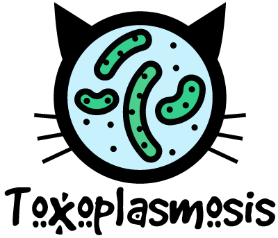
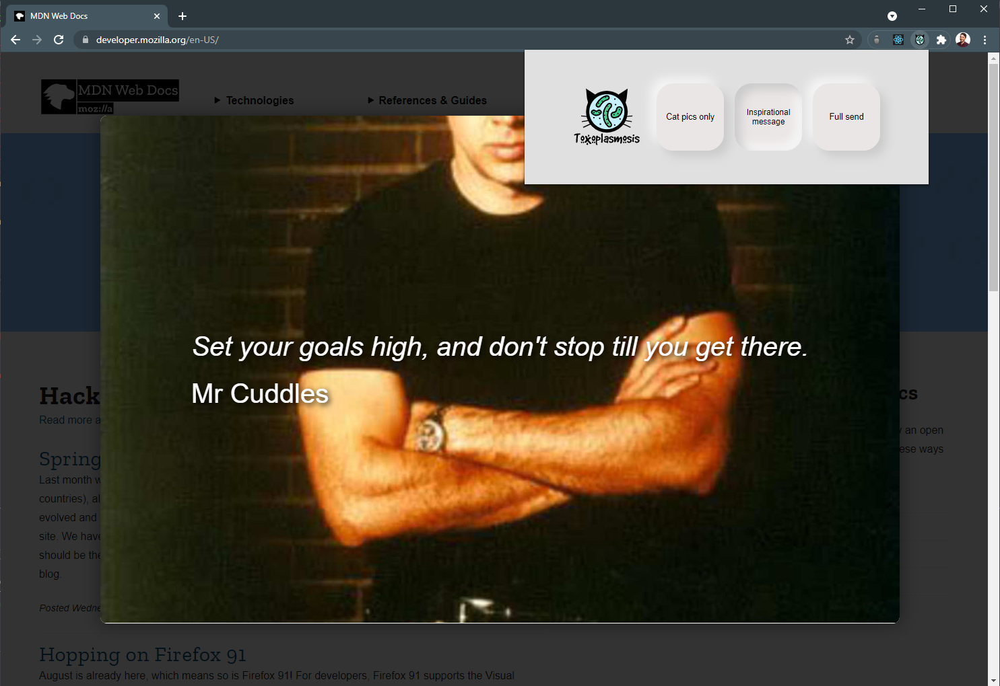

# Toxoplasmosis - A stupid plugin for people that like cats

### **About Toxoplasmosis**

Toxoplasmosis is chrome extension that allows the users to change their browsing experience to be more cat focused leveraging the [Cats as a service](https://cataas.com/#/) API.
Unfortunatley CATAAS severs were down while building this so I opted for using the [Place Cage](https://www.placecage.com/) API instead.
I also wanted to try out some neumorphic buttons.

### **How to install?**
Installation via executable
- Download the zip file **toxoplasmosis_0.0.1.zip** and extract in a folder
- Navigate to chrome and click the extensions icon then open manage extensions
- On the top right toggle the switch onto developer mode
- click **Load unpacked**, select the unzipped folder and click **select folder**

Installation via npm
- Pull the repo
- navigate to the folder containing package.json
- Run **yarn install**
- Run **yarn build**
- Navigate to chrome and click the extensions icon then open manage extensions
- On the top right toggle the switch onto developer mode
- Click **Load unpacked**, select the unzipped folder and click **select folder**

### **How does it work?**

Open the extension and you will be presented with 3 toggles

Change all images to cats (Currently using Nicholas Cage placeholder images)
- Click **Cat pics only**

Get an Inspirational message and a cute cat (Currently using Nicholas Cage placeholder images)
- Click **Inspirational message**
- Click anywhere to close

Change font to cat font, background to paws and all images to cats (Yes yes, currently using Nicholas Cage placeholder images here too)
- Click **Full send**

### **Build With**
- React.js (Hooks, CSS Modules)
- NPM, Yarn, CRA
- Typescript
- Vanilla JavaScript
- Vanilla CSS
- Google Chrome extension tools
- Adobe Illustrator for graphics

### **Potentual Updates**
- Use cat images once CATAAS is back online
- Split content scripts into multiple files
- Add resize listener to the window
- Add toggles for each feature and save state
- Add more features and controls
